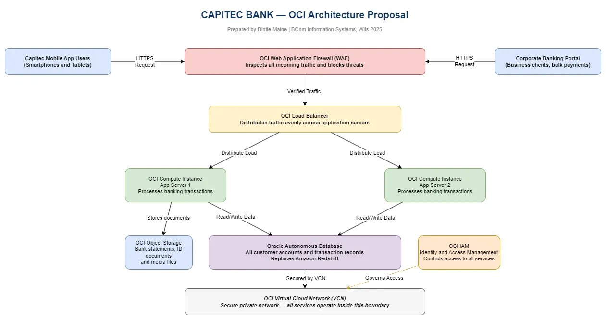

# OCI Architecture Case Study — Capitec Bank Cloud Migration Proposal

## Prepared by
Dintle Maine | BCom Information Systems and Management, University of the Witwatersrand 2025
github.com/dintlemaine-png

---

## Executive Summary
Capitec Bank is one of South Africa's largest and fastest growing retail banks 
with over 22 million customers. Capitec recently completed a migration of its 
core banking system to Amazon Web Services (AWS). This proposal recommends 
adopting Oracle Cloud Infrastructure (OCI) alongside AWS for specific workloads 
where OCI delivers superior performance, cost efficiency and compliance benefits 
for a South African financial institution.

This is a multi-cloud strategy, not a replacement. The goal is to strengthen 
Capitec's infrastructure by leveraging the best of both platforms.

---

## The Business Problem
Capitec faces three infrastructure challenges that OCI is uniquely positioned to solve:

**1. Database Performance**
Capitec uses Amazon Redshift for credit data warehousing and analytics. Oracle 
Autonomous Database on OCI offers superior performance for financial workloads, 
automated tuning, and built-in machine learning capabilities that can improve 
credit risk modelling accuracy.

**2. Oracle Licensing Costs**
If Capitec runs any Oracle software on AWS, they pay full licensing fees. Running 
the same Oracle workloads on OCI includes significant licensing benefits through 
Oracle's Bring Your Own License (BYOL) programme, reducing total cost of ownership.

**3. Disaster Recovery and Compliance**
South African banking regulations require data to remain within South African 
borders. OCI's Johannesburg region (af-johannesburg-1) ensures full SARB and POPIA 
compliance for all data stored and processed on OCI. Having a second cloud provider 
also eliminates single-cloud dependency risk.

---

## Proposed OCI Architecture

The architecture diagram below illustrates how Capitec's systems would operate on OCI.

### Architecture Components

**OCI Web Application Firewall (WAF)**
First line of defence. Inspects all incoming traffic from mobile app users and 
corporate banking portal users. Blocks malicious requests before they reach 
the application layer.

**OCI Load Balancer**
Distributes incoming traffic evenly across two application servers. Ensures no 
single server is overwhelmed and provides high availability. If one server fails 
the other continues serving customers without interruption.

**OCI Compute Instances (App Servers)**
Two application servers running in parallel for redundancy. All banking transaction 
logic runs here. Horizontal scaling means more servers can be added instantly 
during peak periods like month end salary runs.

**Oracle Autonomous Database**
Stores all customer accounts and transaction records. Self-managing, self-securing 
and self-repairing. Eliminates the need for dedicated database administrators and 
reduces operational costs. Directly replaces Amazon Redshift for analytical workloads 
with better performance for financial data.

**OCI Object Storage**
Stores bank statements, customer ID documents, profile photos and media files. 
Highly durable and cost effective. Integrates directly with the application servers.

**OCI IAM (Identity and Access Management)**
Controls who and what can access every service in the environment. Enforces 
least-privilege access principles ensuring no service or user has more access 
than they need.

**OCI Virtual Cloud Network (VCN)**
The secure private network boundary around all OCI services. Nothing enters or 
leaves without explicit permission. All data remains within South Africa 
satisfying SARB and POPIA regulatory requirements.

---

## Business Justification

| Factor | AWS Only | AWS and OCI Multi-Cloud |
|---|---|---|
| Database Performance | Amazon Redshift | Oracle Autonomous Database, superior for financial workloads |
| Oracle Licensing | Full cost on AWS | BYOL savings on OCI |
| Disaster Recovery | Single cloud risk | Two independent cloud providers |
| SA Data Residency | Available | OCI Johannesburg region guarantees SARB and POPIA compliance |
| Scalability | High | High on both platforms |

---

## Why OCI for a South African Bank

Oracle has a long standing relationship with the financial services industry globally. 
OCI's Johannesburg region is one of only a few hyperscaler data centres on the 
African continent, meaning Capitec's data stays in South Africa with low latency 
for local customers. Oracle's Autonomous Database is purpose built for the kind 
of high volume transactional and analytical workloads that a bank like Capitec 
processes daily.

---

## Skills Demonstrated
This case study demonstrates the core Account Cloud Engineering skillset:

- Identifying a real customer's infrastructure challenges through independent research
- Proposing a tailored OCI solution addressing specific business needs
- Designing a formal architecture using industry standard tools
- Justifying the proposal with cost, performance and compliance arguments
- Presenting findings in the format used by Oracle ACE professionals

---

## Tools Used
- Oracle Cloud Infrastructure (OCI) Console
- draw.io for architecture diagram
- Independent research on Capitec's current AWS infrastructure
